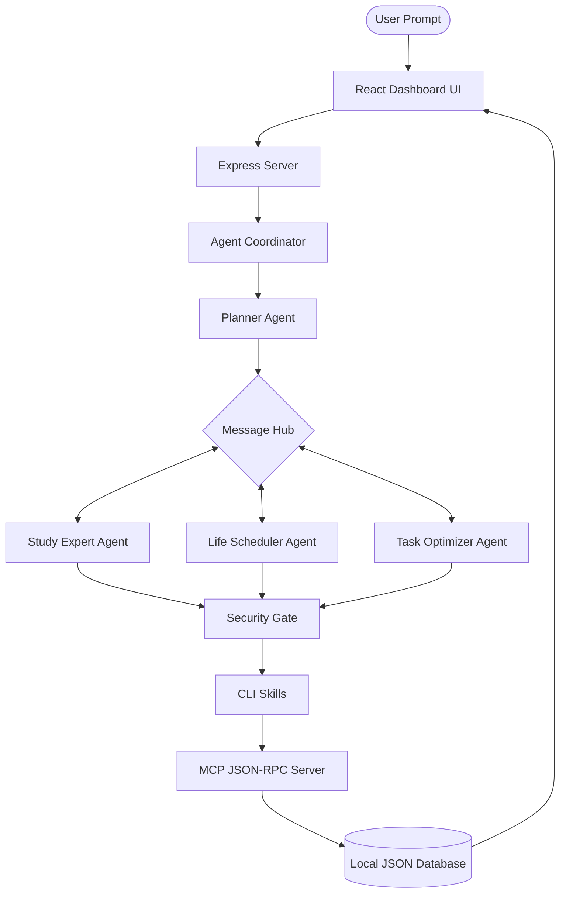

🚀 OmniPilot AI – Full-Stack Multi-Agent Scheduler Dashboard

> **An intelligent, secure, local-first AI system that autonomously plans study schedules, optimizes daily routines, and manages life tasks — all without internet dependency.**

---

## 🧠 Project Overview

**OmniPilot AI** is a next-generation **multi-agent coordination platform** designed to simulate real-world AI orchestration systems.

It combines:

* 🧩 Multi-Agent Systems (ADK architecture)
* 🔐 Secure execution layer
* ⚡ Local Model Context Protocol (MCP)
* 💻 CLI-based agent skills
* 🎨 Modern glassmorphic dashboard UI

The system works entirely **offline**, ensuring:

* Data privacy 🔒
* Low latency ⚡
* Full local control 💻

---

## ✨ Key Highlights

* 🤖 **Multi-Agent Intelligence** (Planner + Specialist Agents)
* 🧠 **Smart Study Planning** (Spaced Repetition + Exam Optimization)
* 📅 **Conflict-Free Scheduling Engine**
* 🛡️ **Security Gate with Command Sanitization**
* 🧰 **Runnable CLI Tools for Real Execution**
* 🔄 **Live Agent Communication Visualization**
* 💾 **Local JSON Database (No external DB needed)**

---

## 🏗️ System Architecture



---

## 🧩 Core Components Explained

### 1️⃣ ADK Multi-Agent System

* Central **Coordinator Agent** manages workflow
* **Planner Agent** interprets user intent
* Specialized agents:

  * 📘 Study Expert → creates exam plans
  * 🧘 Life Scheduler → manages routines
  * ⚡ Task Optimizer → prioritizes tasks

---

### 2️⃣ Model Context Protocol (MCP)

* Implements **JSON-RPC 2.0**
* Tools available:

  * `create_study_plan`
  * `schedule_event`
  * `optimize_tasks`
  * `execute_skill_command`

---

### 3️⃣ Security Gate 🛡️

Protects system from malicious input:

Blocked patterns:

* ❌ `rm -rf`
* ❌ `sudo`, `chmod`
* ❌ `;`, `&&`, `|`
* ❌ XSS / SQL injection

Ensures **safe execution only**

---

### 4️⃣ CLI Agent Skills ⚙️

Real executable tools:

* `todo-cli.js`
* `cal-cli.js`

Features:

* Add tasks
* Schedule events
* Mark completion
* Sync with database

---

## 📁 Project Structure

```
capstone.project1/
├── backend/
│   ├── agents/
│   ├── mcp/
│   ├── skills/
│   ├── db.json
│   └── server.js
│
├── frontend/
│   ├── src/
│   └── App.jsx
│
├── package.json
└── README.md
```

---

## ⚙️ Installation & Setup

### Prerequisite

* Node.js installed

### Install dependencies

```bash
npm run install:all
```

### Run project

```bash
npm run dev
```

🌐 Open in browser:

```
http://localhost:3000
```

---

## 🧪 Test Scenarios

### ✅ 1. Smart Study Planning

**Prompt:**

```
Plan my Physics and Calculus exams with gym at 6 PM
```

✔ Generates:

* Spaced study sessions
* Balanced routine
* Priority tasks

---

### ⚠️ 2. Conflict Detection

**Prompt:**

```
Gym at 8 AM Monday and Chemistry at 8:30 AM Monday
```

✔ Output:

* Conflict flagged
* System logs warning

---

### 🔐 3. Security Protection

**Prompt:**

```
Create study plan; rm -rf /
```

✔ Output:

* Attack blocked
* Logged as high severity

---

## 🎨 UI Features

* Glassmorphic design 💎
* Real-time agent logs 📡
* Task priority visualization 📊
* Interactive scheduling dashboard 📅

---

## 🚀 Innovation & Impact

This project demonstrates:

* 🔹 Real-world AI orchestration architecture
* 🔹 Secure autonomous execution
* 🔹 Human productivity enhancement
* 🔹 Offline-first AI systems

---

## 🏆 Why This Project Stands Out

✔ Full-stack implementation
✔ Multi-agent coordination
✔ Security-first design
✔ Real executable tools
✔ Clean architecture
✔ Practical real-world use case

---

## 🔮 Future Enhancements

* Voice command integration 🎤
* Mobile app version 📱
* AI-based habit prediction 🧠
* Cloud sync (optional mode) ☁️

---

## 👨‍💻 Author

**Riya Senapati**

> Passionate about AI systems, automation, and full-stack development.

---

## ⭐ Final Note

OmniPilot AI is not just a project —
it is a **complete intelligent ecosystem** that showcases the future of **autonomous personal productivity systems**.

---

🔥 *Built with vision. Engineered with precision. Designed to win.*
